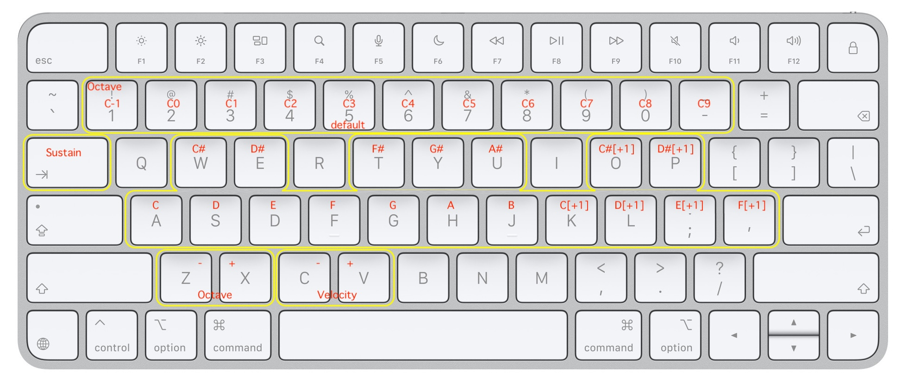

# BLE-MIDI-Keyboard (M5StickS3)

（English: [README.md](README.md)）

市販の **BLE HID キーボード**を **USB-MIDI キーボードコントローラー**に変換します。

M5StickS3 が BLE キーボードに HID ホストとして接続し、同時に USB-C 経由で PC 側からは
**「USB Audio デバイス（MIDI クラス）」**として認識されます。BLE キーボードのキー操作は
USB-MIDI メッセージ（note-on / note-off / CC）に変換され、PC の DAW やソフトシンセからは
**`M5StickS3 BLE-MIDI`** という名前の標準 MIDI 入力として見えます。

```
 BLE キーボード  ──BLE HID──▶  M5StickS3 (ESP32-S3)  ──USB-MIDI──▶  PC / DAW
```

---

## ハードウェア

| 構成 | 備考 |
|------|------|
| **M5StickS3**（ESP32-S3、135×240 LCD） | 主対象。ボタン A / B を UI に使用 |
| **BLE**（Bluetooth Low Energy）HID キーボード | HID over GATT（サービス `0x1812`）を出すこと。Classic Bluetooth 専用キーボードは **不可**（ESP32-S3 は Classic BT 無線を持たない） |
| PC への USB-C ケーブル | USB-MIDI ＋ USB CDC シリアルコンソールを伝送 |

画面のない **素の ESP32-S3 Dev ボード**でも動作します（[ヘッドレス運用](#ヘッドレス運用) 参照）。

---

## ビルドと書き込み

### ボードオプション（必須）

| 項目 | 値 |
|------|-----|
| ボード | `M5StickS3`（`m5stack:esp32:m5stack_sticks3`） |
| USB Mode | **USB-OTG (TinyUSB)** |
| USB CDC On Boot | **Enabled** |
| Partition Scheme | `8M with spiffs`（`default_8MB`）以上 |

`USB-OTG (TinyUSB)` は必須です。組み込みの `USBMIDI` クラスはこのモードにしか存在しません。
`ARDUINO_USB_MODE` が Hardware-CDC モードを示す場合は、スケッチの `#error` ガードで
ビルドが止まります。

### ライブラリ

| ライブラリ | 入手先 |
|-----------|--------|
| **NimBLE-Arduino**（>= 2.5） | ライブラリマネージャ / `arduino-cli lib install NimBLE-Arduino` |
| `M5Unified`、`USB` / `USBMIDI`、`Preferences` | M5Stack ESP32 コアに同梱 |

### arduino-cli

`sketch.yaml` に FQBN とオプションを固定済みです:

```bash
arduino-cli compile --profile default        # または:
arduino-cli compile --fqbn "m5stack:esp32:m5stack_sticks3:PartitionScheme=default_8MB,USBMode=default,CDCOnBoot=cdc" .
arduino-cli upload  --fqbn "m5stack:esp32:m5stack_sticks3:PartitionScheme=default_8MB,USBMode=default,CDCOnBoot=cdc" -p /dev/cu.usbmodemXXXX .
```

書き込み後、PC からは複合 USB デバイスとして
シリアルポート（115200）**と** MIDI ポート `M5StickS3 BLE-MIDI` が見えます。

---

## 初回のペアリング

1. M5StickS3 に電源を入れる。ボンド情報が無ければ **SCAN** から開始します。
2. BLE キーボードをペアリングモードにする（または、キーを押して起こしアドバタイズさせる）。
3. **BTN-A** で一覧のカーソルを移動（一方向・末尾で先頭へ）。
   名前をアドバタイズしているデバイスのみ一覧表示され、`HID`（緑）はキーボードクラスを示します。
4. **BTN-B** で選択中のデバイスに決定。**Just Works** ペアリング（パスキーなし）で接続・ボンドし、
   ボンド情報とデバイス名を NVS に保存します。

> 数字パスキーを要求するキーボードは Just Works では扱えず、ボンドに失敗します
> （シリアルログ参照）。

---

## 自動再接続

BLE キーボードは無操作ですぐスリープしてリンクを切ります。本ファームウェアは
再接続を **自動化**しており、ボタン操作は不要です:

* 起動時にボンドがあれば即 **WAIT** に入り、**タイムアウト無しの非同期接続**を張ります。
  BLE コントローラは接続要求を保留したまま保持し、キーボードが再びアドバタイズした瞬間
  （＝キーを押して起こした瞬間）に接続します。
* **PLAY** 中にキーボードがスリープした場合も、自動的に **WAIT** に戻って張り直します。
  そのままキー入力を再開すれば繋がります。
* ランダムアドレス（RPA）を使うボンド済みキーボードも、保存済み IRK で解決するので
  保留中の接続がマッチします。

キーボードを ESP32-S3 側から起こし続けることは **しません**。キーボードのファームは
*キー*無操作でスリープし、スリープ時にリンクを切るため、セントラル側の通信では防げません。

### ステートマシン

| 状態 | 意味 | BTN-A | BTN-B |
|------|------|-------|-------|
| **SCAN / LIST** | スキャン中・デバイス一覧表示 | カーソル移動（ラップ）／*長押し*: 再スキャン | 決定 ／ *長押し*: ボンド全削除 |
| **WAIT** | ボンド済み相手への非同期自動接続を保留中 | 中止 → SCAN | 今すぐ再試行 |
| **PLAY** | キーを USB-MIDI に変換中 | — | 切断 → SCAN（自動再接続を止める） |
| **FAILED** | 接続 / セットアップ失敗 | → SCAN | 同じ相手で WAIT を張り直す |

接続後のセットアップ（暗号化＋サービス探索＋購読）は最大 5 回リトライし、
超えると **FAILED** に落ちます。

---

## キー割り当て



### 1. 鍵盤

`keydown` → note-on、`keyup` → note-off。ベロシティは可変（§4 参照）、既定 **98**。

| キー | `A` | `W` | `S` | `E` | `D` | `F` | `T` | `G` | `Y` | `H` | `U` | `J` | `K` | `O` | `L` | `P` | `;` | `'` |
|------|----|----|----|----|----|----|----|----|----|----|----|----|-----|------|-----|------|-----|-----|
| 音程 | C | C# | D | D# | E | F | F# | G | G# | A | A# | B | C+1 | C#+1 | D+1 | D#+1 | E+1 | F+1 |
| オフセット | 0 | 1 | 2 | 3 | 4 | 5 | 6 | 7 | 8 | 9 | 10 | 11 | 12 | 13 | 14 | 15 | 16 | 17 |

発音する MIDI ノート = **オクターブベース + オフセット**。オクターブが変わると、
発音中のノートは新しい音程で鳴らし直します。

> US 配列の `'` キーは JIS 配列では `:` キーです。キーコードは同じ（`0x34`）なので
> 割り当ても同一です。

### 2. オクターブ

`keydown` で処理。

| キー | `1` | `2` | `3` | `4` | `5` | `6` | `7` | `8` | `9` | `0` | `-` |
|------|----|----|----|----|-----|-----|-----|-----|-----|-----|-----|
| ベース音 | 0 | 12 | 24 | 36 | **48** | 60 | 72 | 84 | 96 | 108 | 120 |

`5`（ベース 48）が既定。各キーの音域は `base … base+17`。127 を超えるノートは破棄します。

| キー | 動作 |
|------|------|
| `Z` | オクターブ **下げ**（base −12、下限 0） |
| `X` | オクターブ **上げ**（base +12、上限 120） |

### 3. サステインペダル

| キー | keydown | keyup |
|------|---------|-------|
| `TAB` | CC64 = 127（サステイン ON） | CC64 = 0（サステイン OFF） |

### 4. ベロシティ

`keydown` で処理。以降の note-on に適用（既定 **98**）。

| キー | 動作 |
|------|------|
| `C` | ベロシティ −5（下限 1） |
| `V` | ベロシティ +5（上限 127） |

MIDI はすべて **チャンネル 1** で送出します。

---

## シリアルコンソール

USB CDC シリアルポート（115200）は画面の案内文をミラー出力し、キーイベントを
ストリームします。例:

```
========================================
[WAIT] auto-connect armed for My Keyboard  [10:05:aa:3f:0a:28]
  connects automatically as soon as the keyboard wakes up
  a  BTN-A press = cancel -> scan
  b  BTN-B press = retry now
========================================
[   42500] DOWN A      (0x04)  ON  C3 48
[   43120] DOWN Z      (0x1D)  OCT C2 (36)
[   44300] DOWN TAB    (0x2B)  SUSTAIN on
[   45010] DOWN V      (0x19)  VEL 103
```

## ヘッドレス運用

画面のないボードでも、シリアルコンソールから完全に操作できます:

| 入力 | 動作 |
|------|------|
| `a` / `b` | BTN-A / BTN-B の **press（短押し）** |
| `A` / `B` | BTN-A / BTN-B の **long press（長押し）** |
| `?` | 現在の状態・ガイド（スキャン中はデバイス一覧も）を再表示 |

物理ボタンとシリアル入力は OR で処理されるため、両方同時に使えます。

素の ESP32-S3 Dev ボード向けにビルドする場合は、`#include <M5Unified.h>` を
コメントアウトし、以降コンパイルエラーになる行（`M5.*` / `canvas.*` の表示・ボタン
コード）をすべてコメントアウトします。シリアルコンソールがそのまま UI になります。

---

## 制限事項

* **BLE HID のみ。** Classic Bluetooth キーボードは非対応。
* **Just Works ペアリングのみ。** パスキーを要求するキーボードはボンドできません。
* **Boot 形式のレポート解析**: 8 バイトの `[mods][rsv][k0..k5]`。
  コンシューマ/メディアキーや NKRO レポートは無視します。
* （再）接続のたびに約 1〜2 秒、ペアリング＋サービス探索の間、画面とシリアル
  コンソールが応答しなくなります。

---

## ファイル

| ファイル | |
|---------|--|
| `BLE-MIDI-Keyboard.ino` | スケッチ本体 |
| `sketch.yaml` | arduino-cli プロファイル（FQBN・ボードオプション・ポート） |
| `README.md` | 英語版 |
| `README_JP.md` | このファイル |
